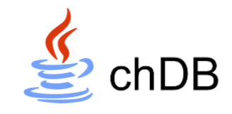

chdb Java FFM binding
======================


chdb-java-ffm is Java 22+ [JEP 454: Foreign Function & Memory API](https://openjdk.org/jeps/454) bind for [chdb](https://github.com/chdb-io).

# Get started

- Please add the following dependency to `pom.xml`:

```xml

<dependency>
    <groupId>org.mvnsearch</groupId>
    <artifactId>chdb-java-ffm</artifactId>
    <version>0.2.0</version>
</dependency>
```

- Download chdb dynamic library by executing `update_libchdb.sh` script, or download from https://github.com/chdb-io/chdb/releases.
- Write your first test:

```java
public class ChdbConnectionTest {

    @AutoClose
    private static Connection conn;

    @BeforeAll
    public static void setUp() throws Exception {
        String url = "jdbc:chdb::memory:";
        conn = DriverManager.getConnection(url);
    }

    @Test
    public void testConnection() throws SQLException {
        String sql = "select * from file('src/test/resources/logs.csv','CSV')";
        Statement statement = conn.createStatement();
        ResultSet resultSet = statement.executeQuery(sql);
        while (resultSet.next()) {
            System.out.println(resultSet.getString("level"));
        }
    }
}
```

# chdb JDBC

JDBC URLs:

- `jdbc:chdb::memory:`: in-memory database, path is **`:memory:`**
- `jdbc:chdb:/path/to/db`: database from file path, and both relative and absolute paths supported.

# Development setup

- Download and install [JDK 22](https://jdk.java.net/22/)
- Download and install [jextract](https://jdk.java.net/jextract/)
- Execute `update_libchdb.sh` to download dynamic library

# FAQ

### How to load dynamic library from other path?

Execute `ln -s /usr/local/lib/libchdb.so libchdb.dylib` to link the dynamic library to the current directory.

### Update operation support?

Now only query support, and update will be implemented in the future.

### PreparedStatement support?

Now PreparedStatement implement is not real, just fake implement friendly for libraries and frameworks.

### Spring Jdbc support?

Yes, you can use `JdbcTemplate` with chdb-java-ffm. 

### How it works?

Java -> FFM -> chdb(embedded) -> JSON Output -> ResultSet.

**Attention**: chdb-java-ffm uses Jackson for JSON parsing.

# References

* [JEP 454](https://openjdk.org/jeps/454): Foreign Function & Memory API
* [jextract](https://jdk.java.net/jextract/): a tool which mechanically generates Java bindings from native library headers
* [chdb-java](https://github.com/chdb-io/chdb-java): chdb JNI version
* [clickhouse-java](https://github.com/ClickHouse/clickhouse-java): Java client and JDBC driver for ClickHouse